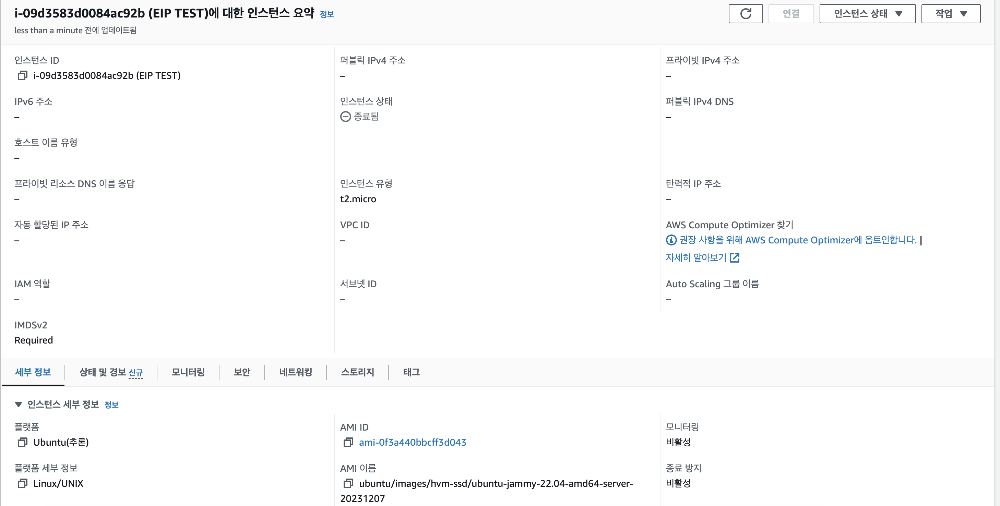
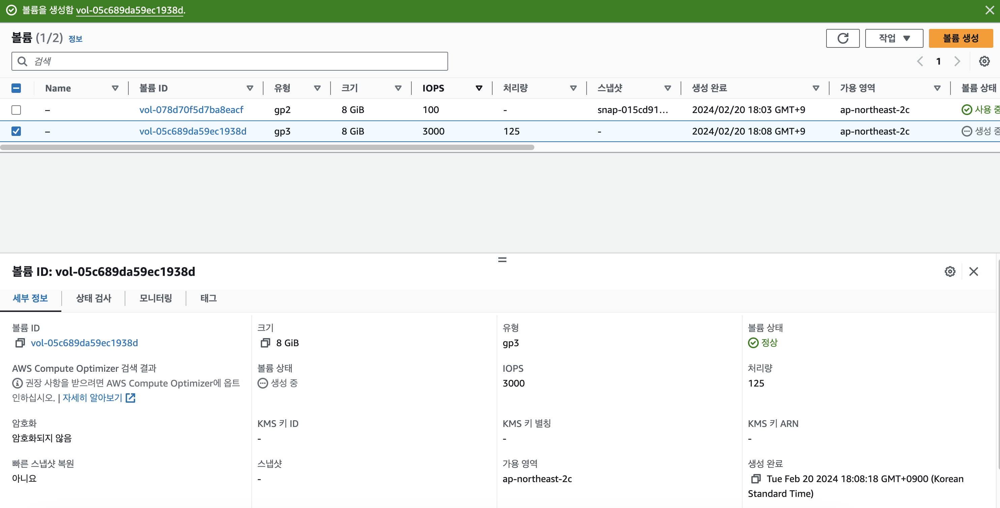
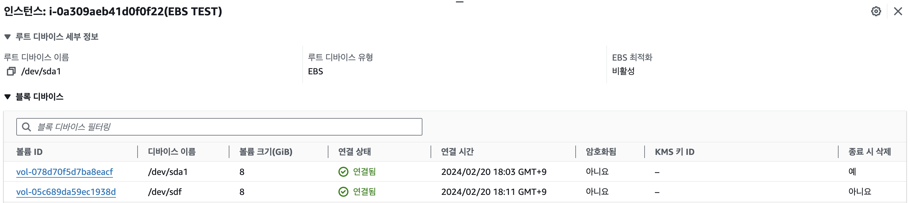
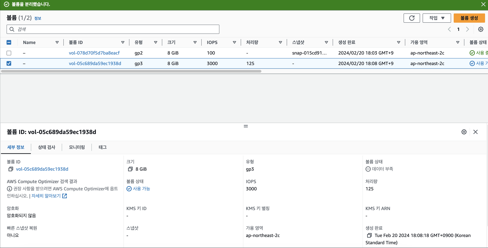
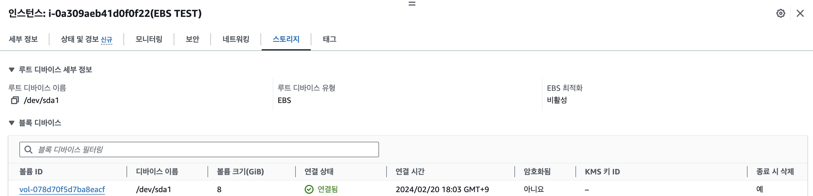
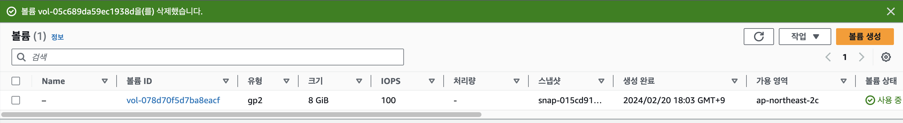
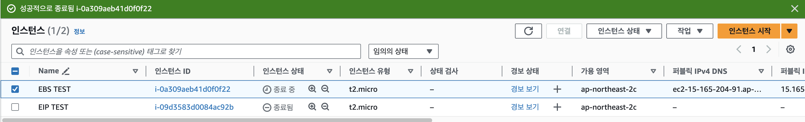

# EBS
### 1. EC2 인스턴스 생성하기 (서울 리전, Ubuntu, t2.micro)

### 2. EBS 볼륨 생성하기 (EC2 인스턴스와 같은 리전 + 가용영역, 용량 8GB)

### 3. EC2 인스턴스에 EBS 볼륨 연결하기

### 4. EC2 인스턴스에서 EBS 볼룸 제거하기

### 5. EBS 볼륨 삭제하기

### 6. EC2 인스턴스 종료하기
