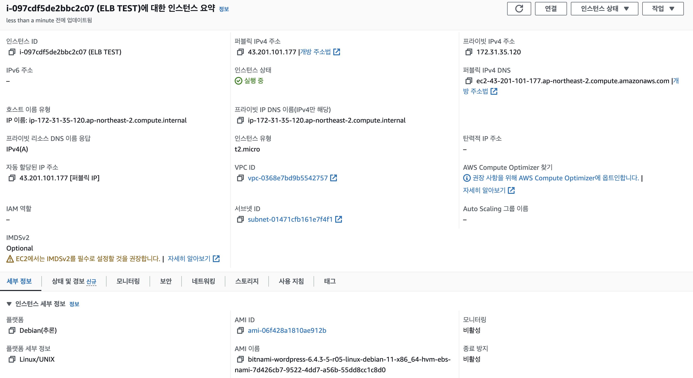
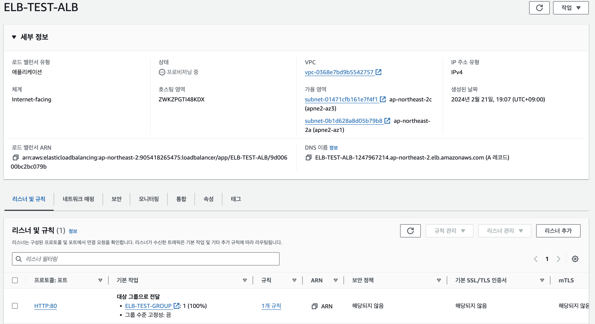
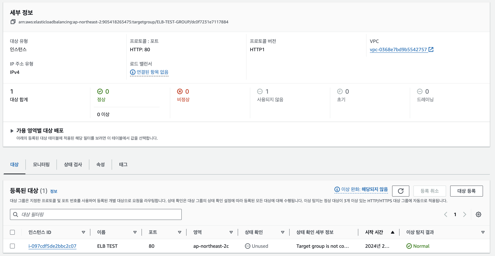
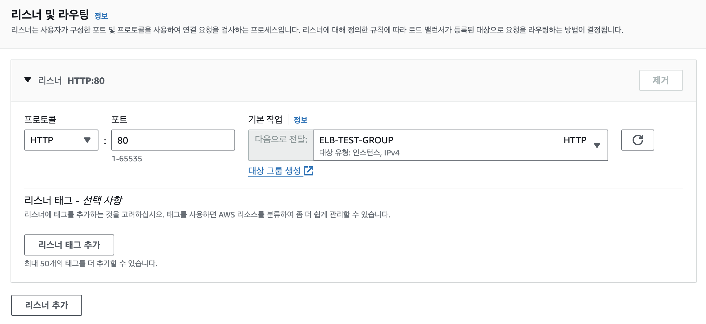
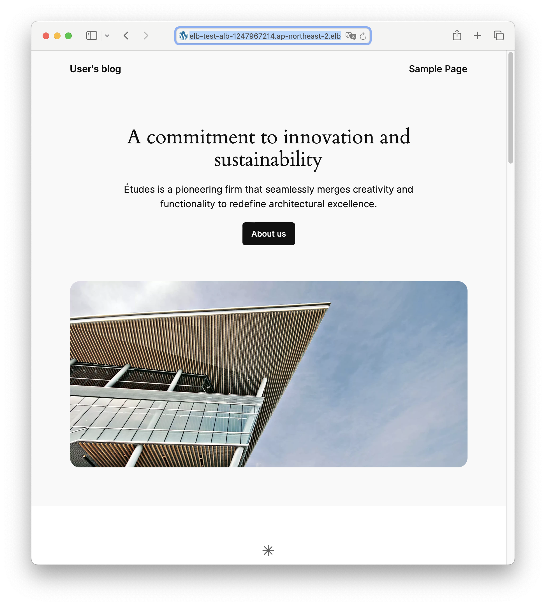
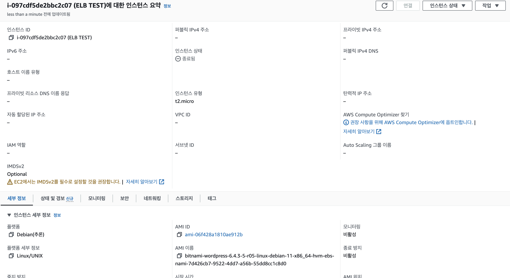

# ELB

### 1. 로드밸런싱이 필요한 이유와 역할 설명해보기
> [!NOTE]
> 로드밸런싱을 하지 않으면 모두가 불만이다.

> 서버가 여러개 있어도 모든 트래픽이 하나의 서버로만 몰리면 감당할 수 없는 양의 요청이 온다면 서버는 장애를 일으키게되고, 트래픽이 오지않는 서버는 방치된채로 낭비가 된다. 서버가 장애를 일으키면 서비스를 운영하는 입장에서는 서비스를 안정적으로 제공하지 못해 손실을 입게되고, 사용자는 제대로된 서비스를 공급받지 못해 피해를 입게된다. 이처럼 하나의 서버로 모든 트래픽이 몰리는 것을 방지하고 안정적으로 서비스를 운영하기 위해서는 로드밸런싱이 필요하다.

### 2. EC2 인스턴스 생성하기 (서울 리전, Bitnami Wordpress, t2.micro)

### 3. ALB 생성하기 (EC2 인스턴스와 같은 리전)

### 4. 대상 그룹도 함께 생성하고 EC2 인스턴스를 대상 그룹에 포함시키기

### 5. ALB의 주소를 통해 EC2 인스턴스에 접속하기

### 6. EC2 인스턴스 종료하기
