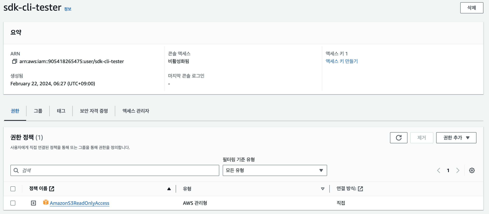
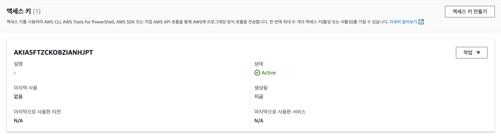
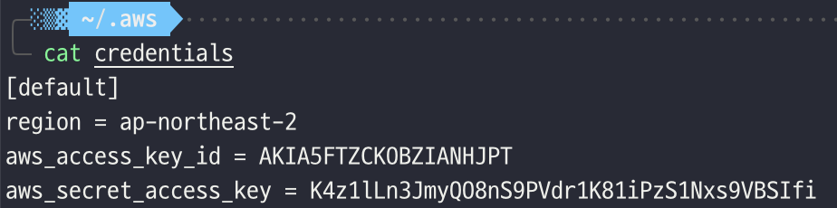
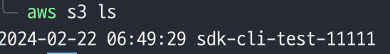
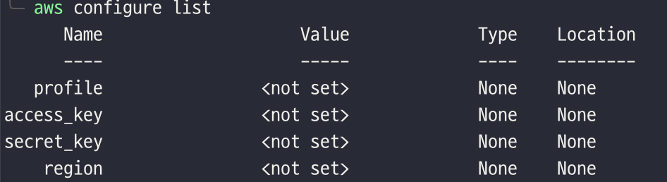
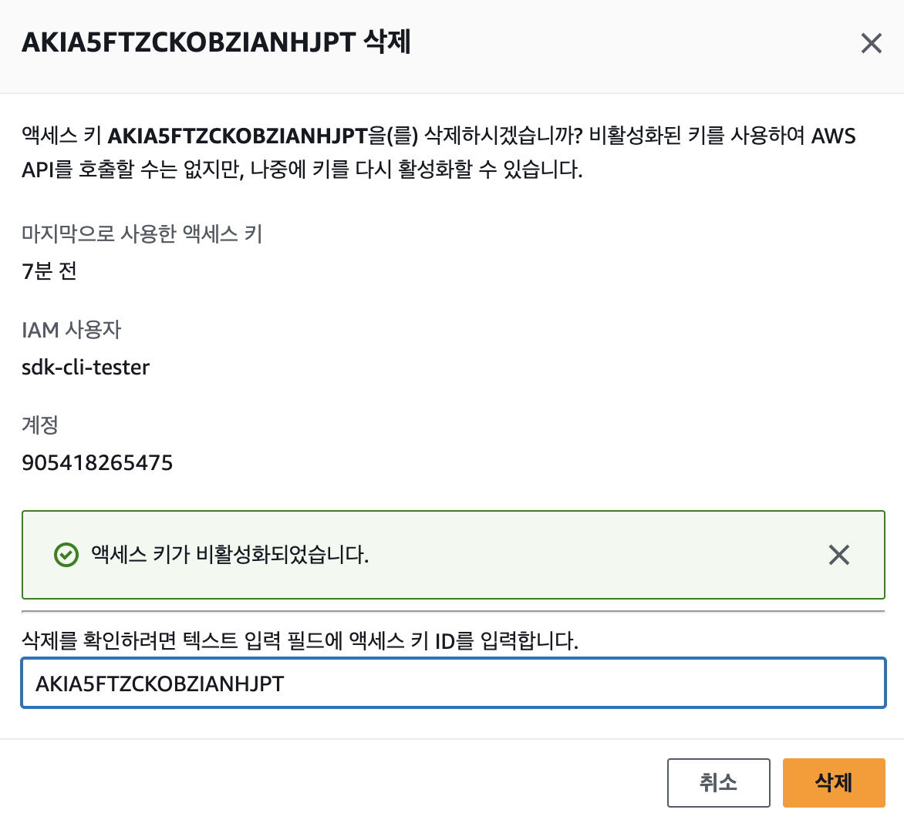
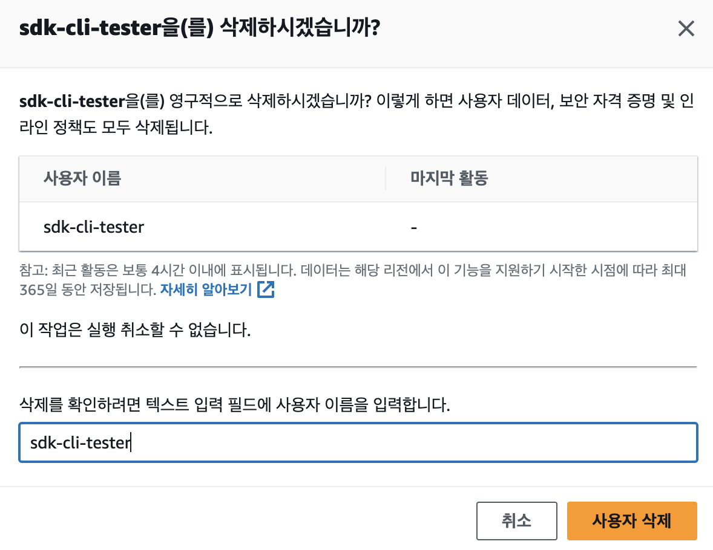

# AWS SDK, CLI (공유 자격 증명 설정)
### 1. IAM 사용자 생성하기 (S3ReadOnlyAccess 권한 포함)

### 2. 생성한 IAM 사용자에 액세스 키 만들기 (CLI 용도)

### 3. 생성한 액세스 키를 사용하여 사용 중인 컴퓨터에 공유 자격 증명 설정하기

### 4. AWS CLI를 설치하여 S3 명령어 테스트 해보기

### 5. 공유 자격 증명 제거하기

### 6. IAM 사용자 삭제하기

