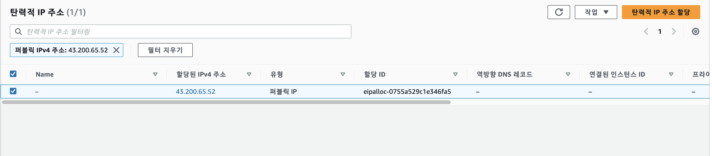
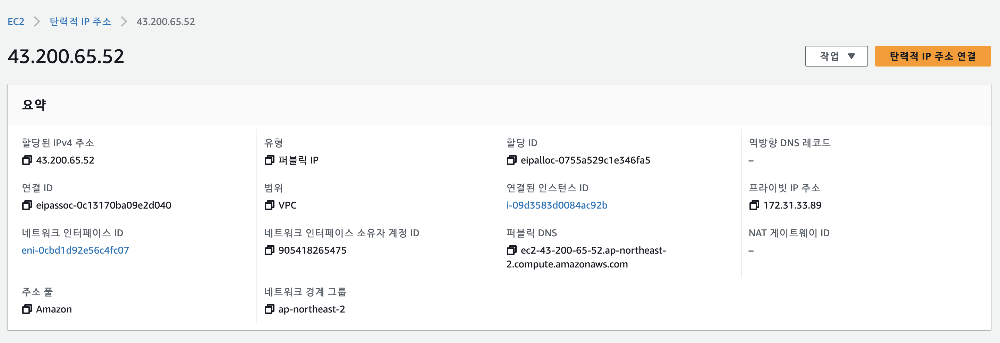
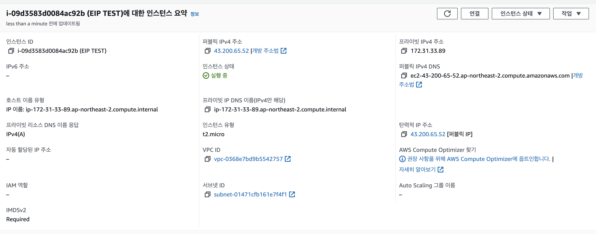
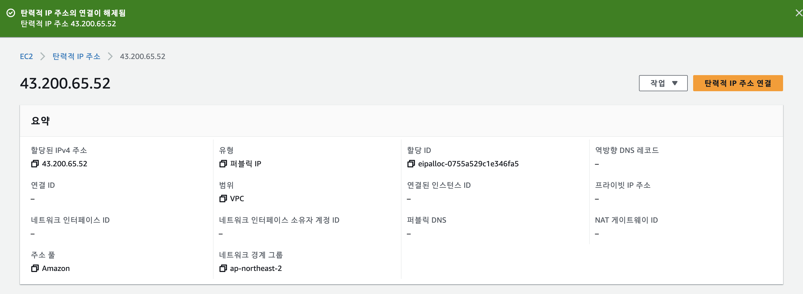

# Elastic IP
### 1. EC2 인스턴스 생성하기 (서울 리전, Ubuntu, t2.micro)

### 2. Elastic IP 할당받기

### 3. 할당 받은 Elastic IP를 EC2 인스턴스에 연결하기

### 4. 연결한 이후 Elastic IP를 통해 `ssh` 접속하기

### 5. EC2 인스턴스에서 Elastic IP 연결 해제하기

### 6. 할당 받은 Elastic IP 릴리즈 하기

### 7. EC2 인스턴스 종료하기
