# Auto Scaling

### 1. Auto Scaling이 필요한 이유와 역할 설명해보기
> [!NOTE]
> 늘리기만하고 줄이지 못한다면 줄줄 샌다.

> 트래픽 증가가 예측되어 서버를 미리 확보하는 것은 좋지만 트래픽이 증가하기 전까지 서버가 낭비되고, 서버를 증가시켜놓은 뒤 트래픽이 서버용량보다 현저히 줄어들면 다시 서버가 낭비된다.  
> 오토스케일링은 이런 경우를 대비하여 설정된 상황에 맞춰 인스턴스의 수를 조절해주고 이에따라 서비스 제공자는 낭비되는 비용을 최소화할 수 있다.

### 2. EC2 인스턴스 생성하기 (서울 리전, Bitnami Wordpress, t2.micro)

### 3. ALB 생성하기 (EC2 인스턴스와 같은 리전)
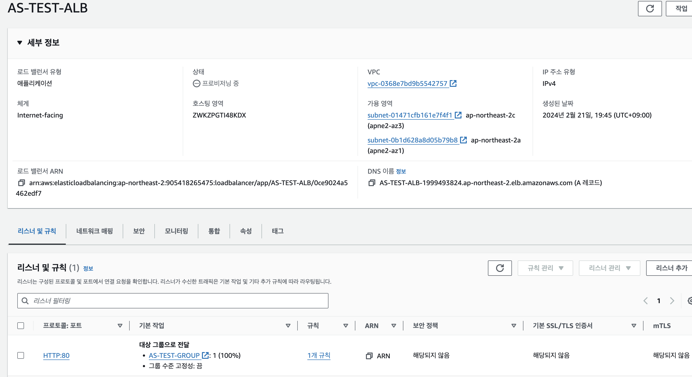
### 4. 생성한 EC2 인스턴스를 기반으로 AMI 생성하기
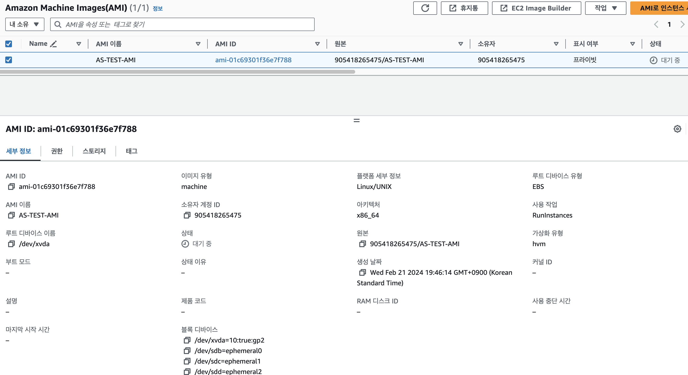
### 5. Auto Scaling Group(ASG) 만들기
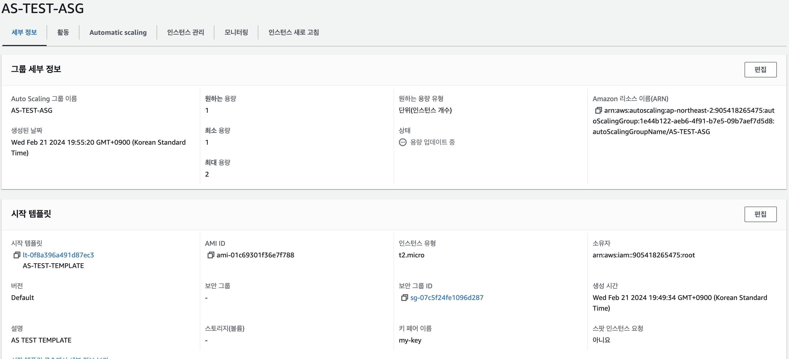
- #### 시작 템플릿도 함께 생성하기
> 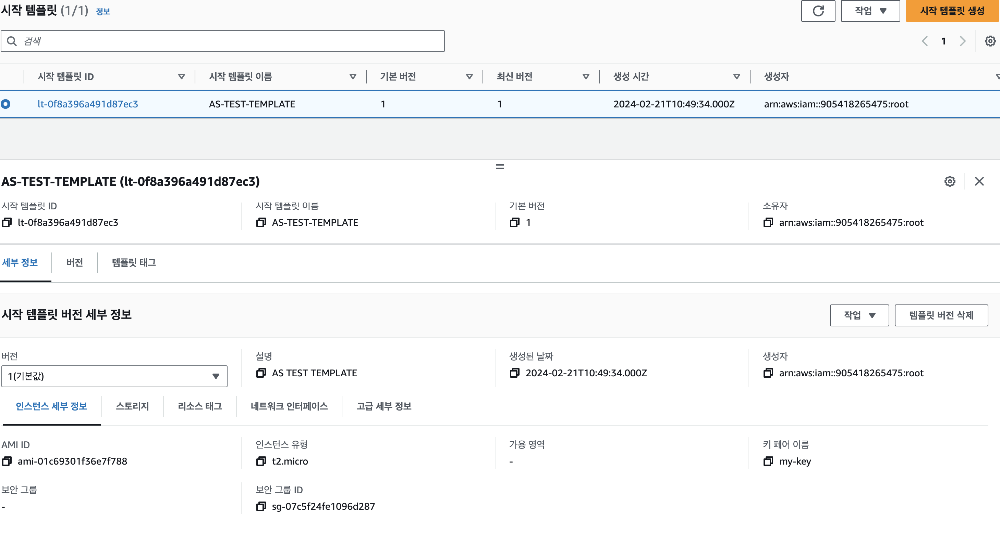
> 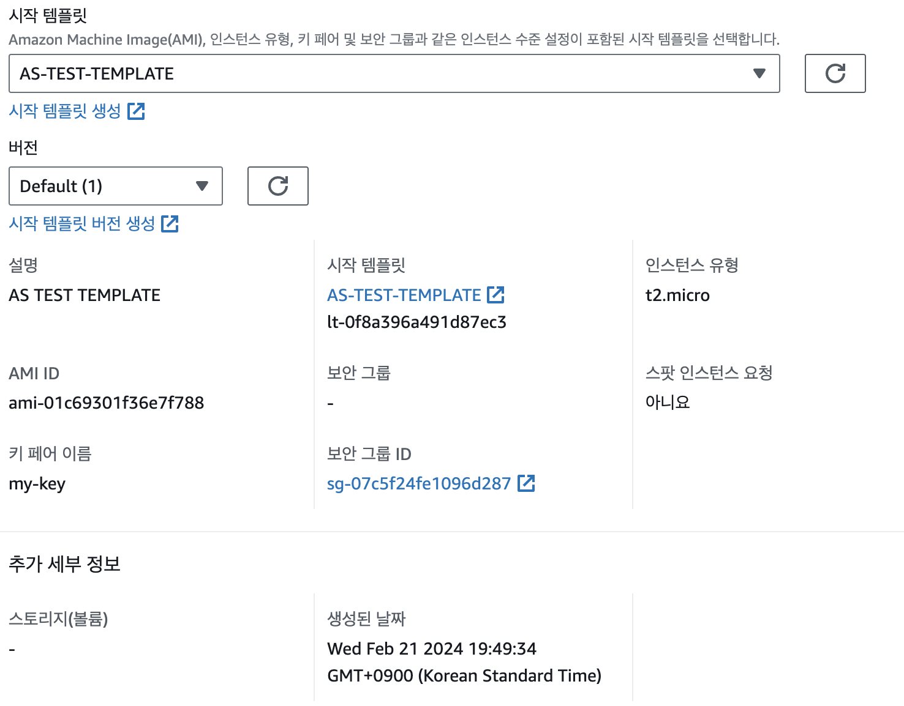
- #### ALB와 연결하기
> 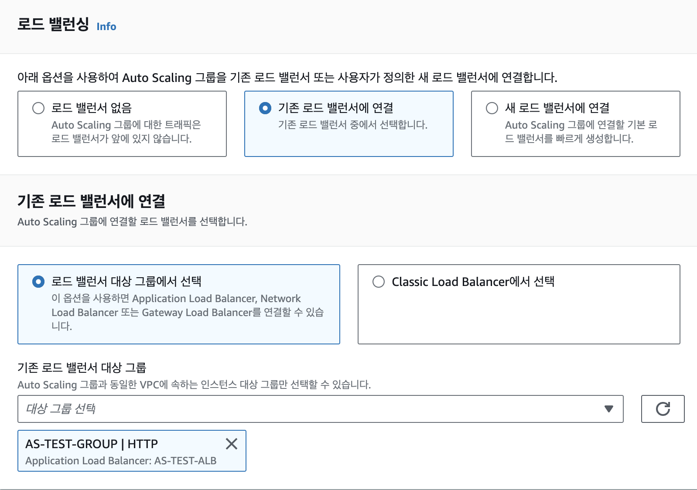

### 6. EC2 인스턴스에 `ssh`로 접속하고 `stress`를 사용하여 Auto Scaling 작동 테스트 하기
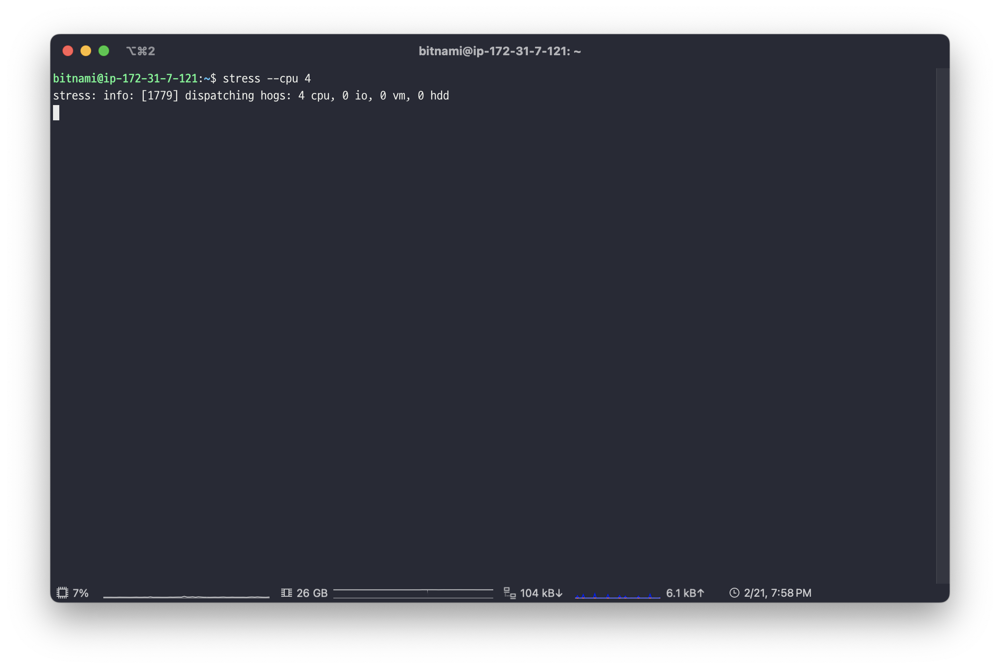
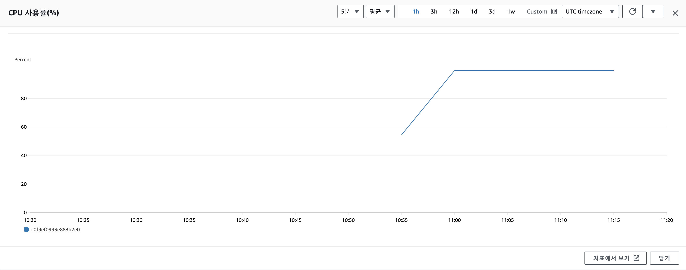
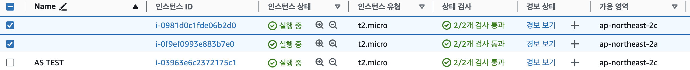
### 7. 모든 리소스(EC2, AMI, ASG, ALB 등) 정리하기
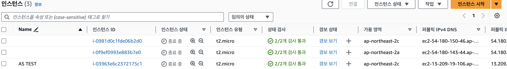
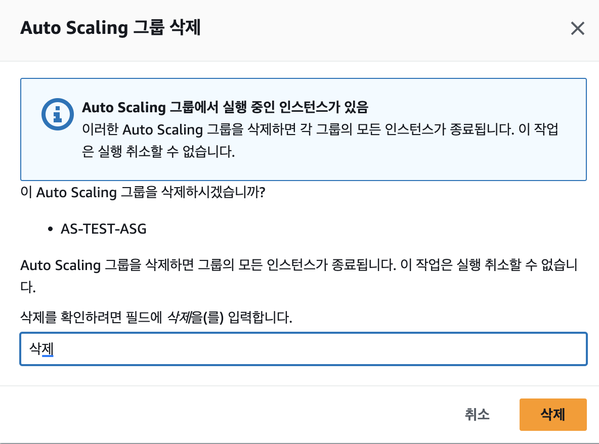

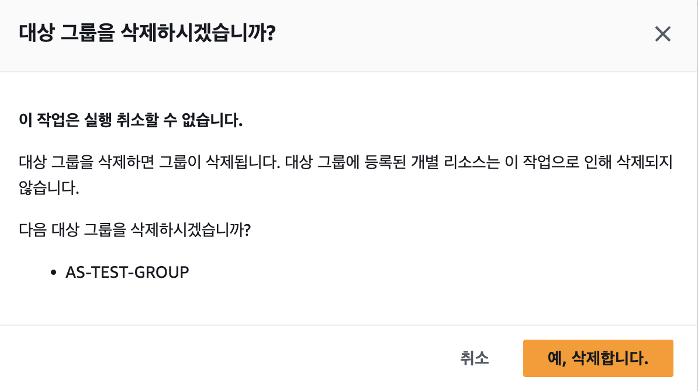
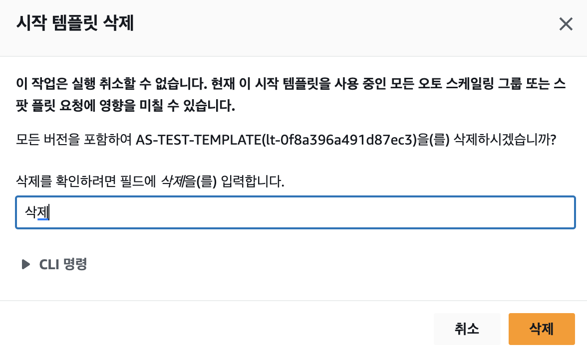

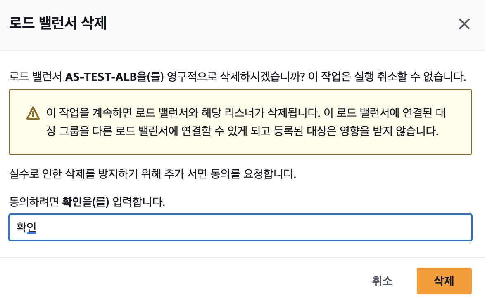