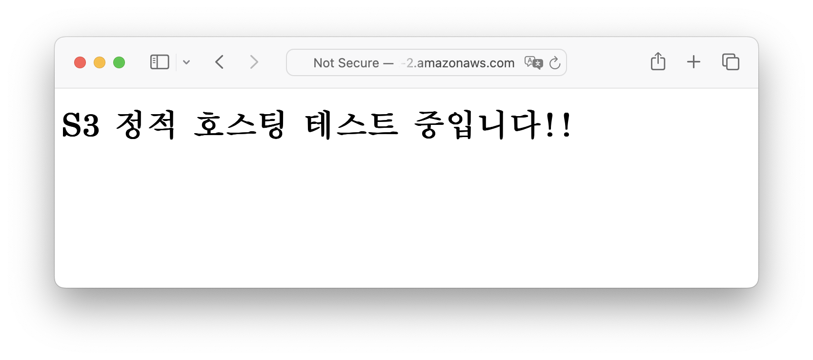

# S3 (정적 웹사이트 호스팅)
### 1. S3 버킷 생성하기 (서울 리전)

### 2. 버킷의 정적 웹사이트 호스팅 활성화 하기

### 3. 생성한 버킷에 간단하게 작성한 index.html 파일 업로드 하기

### 4. 버킷의 퍼블릭 액세스 차단 해제하기

### 5. 버킷 정책 편집하기 (외부에서 모든 객체에 접근할 수 있도록)

### 6. 버킷 웹 사이트 엔드포인트로 접속하여 웹 사이트가 잘 나오는지 확인하기

### 7. 버킷 삭제하기
